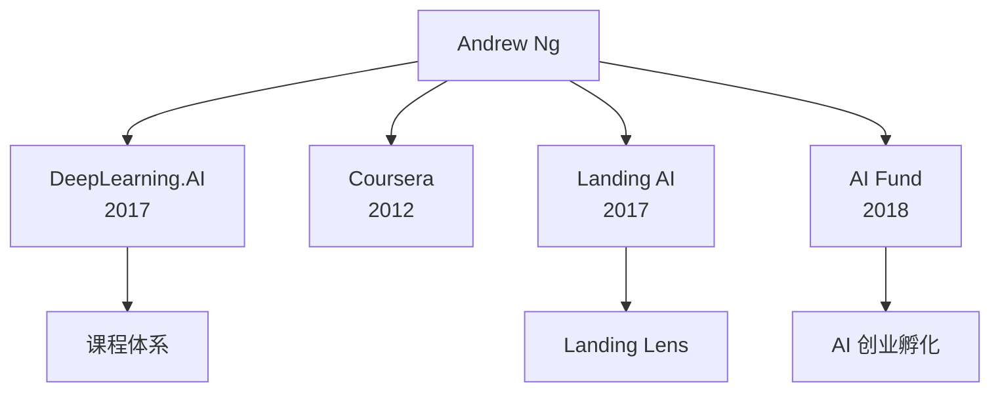

# 企业版图

Andrew Ng 创立或联合创立的 AI 企业。

## [[coursera]]

- **联合创始人**（与 Daphne Koller）
- **创立**：2012
- **领域**：大规模在线教育
- **现状**：2021 年上市（NYSE: COUR）

## [[deeplearning-ai]]

- **创始人 & CEO**
- **创立**：2017
- **领域**：AI 教育
- **旗舰产品**：Deep Learning Specialization、The Batch、AI Python for Beginners

## [[landing-ai]]

- **创始人 & CEO**
- **创立**：2017
- **领域**：工业视觉 AI
- **产品**：Landing Lens — 制造业视觉质检

## [[ai-fund]]

- **创始人 & 管理合伙人**
- **创立**：2018
- **领域**：AI 创业风险投资
- **模式**：孵化+投资，帮助 AI 创业者从 0 到 1
